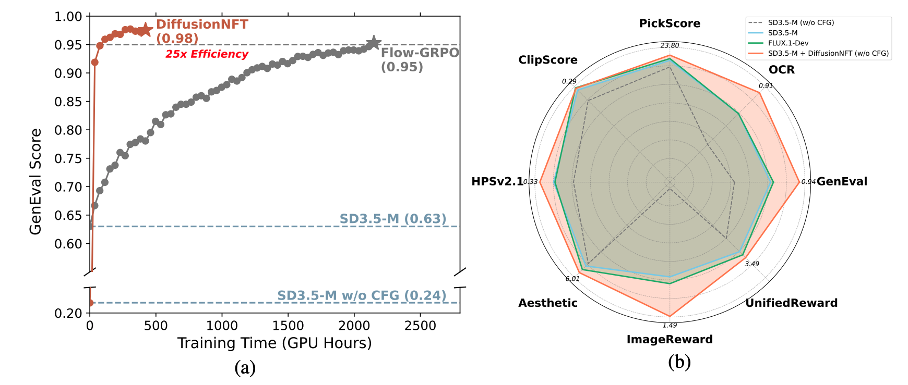
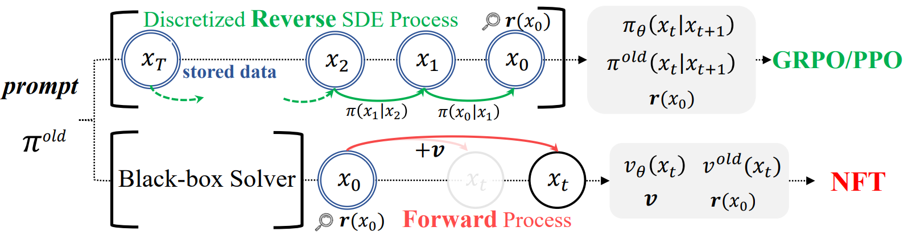

<h1 align="center"> DiffusionNFT:<br>Online Diffusion Reinforcement with Forward Process </h1>
<div align="center">
  <a href='https://arxiv.org/abs/2509.16117'></a>  &nbsp;
  <a href='https://research.nvidia.com/labs/dir/DiffusionNFT'></a> &nbsp;
  <a href='https://huggingface.co/worstcoder/SD3.5M-DiffusionNFT-MultiReward'></a> &nbsp;
</div>

## Algorithm Overview

**DiffusionNFT** is a new online reinforcement learning paradigm for diffusion models that performs policy optimization directly on the **forward diffusion process**.

-   **Solver-Agnostic:** Unlike GRPO, DiffusionNFT is compatible with any black-box sampler (e.g., high-order ODE solvers) throughout data collection.
-   **Theoretically Consistent & Memory Efficient:** By operating on the forward process, DiffusionNFT maintains forward consistency and only requires clean images for training, instead of the entire sampling trajectories.
-   **Simple & Compatible:** DiffusionNFT is built on the standard flow-matching objective, making it easy to integrate into existing diffusion training codebases.

<p align="center">
  
</p>


The DiffusionNFT pipeline consists of:
1.  **Data Collection:** The current sampling policy $v^\text{old}$ generates images, which are evaluated by a reward function.
2.  **Conceptual Data Split:** Images are conceptually split into positive and negative subsets based on their rewards.
3.  **Forward Process Optimization:** The training policy $v_\theta$ is optimized on noised versions of the collected images. Our novel loss function uses the rewards to weigh between implicit positive and negative objectives, directly integrating the reinforcement signal into the model's parameters.

<p align="center">
  
</p>

## Environment Setup
Our implementation is based on the [Flow-GRPO](https://github.com/yifan123/flow_grpo) codebase, with most environments aligned.

Clone this repository and install packages by:
```bash
git clone https://github.com/NVlabs/DiffusionNFT.git
cd DiffusionNFT

conda create -n DiffusionNFT python=3.10.16
pip install torch==2.6.0 torchvision==0.21.0 --index-url https://download.pytorch.org/whl/cu126
pip install -e .
```
## Reward Preparation

Our supported reward models include [GenEval](https://github.com/djghosh13/geneval), [OCR](https://github.com/PaddlePaddle/PaddleOCR), [PickScore](https://github.com/yuvalkirstain/PickScore), [ClipScore](https://github.com/openai/CLIP), [HPSv2.1](https://github.com/tgxs002/HPSv2), [Aesthetic](https://github.com/christophschuhmann/improved-aesthetic-predictor), [ImageReward](https://github.com/zai-org/ImageReward) and [UnifiedReward](https://github.com/CodeGoat24/UnifiedReward). We additionally support `HPSv2.1` on top of FlowGRPO, and simplify `GenEval` from remote server to local. 

### Checkpoints Downloading

```bash
mkdir reward_ckpts
cd reward_ckpts
# Aesthetic
wget https://github.com/christophschuhmann/improved-aesthetic-predictor/raw/refs/heads/main/sac+logos+ava1-l14-linearMSE.pth
# GenEval
wget https://download.openmmlab.com/mmdetection/v2.0/mask2former/mask2former_swin-s-p4-w7-224_lsj_8x2_50e_coco/mask2former_swin-s-p4-w7-224_lsj_8x2_50e_coco_20220504_001756-743b7d99.pth
# ClipScore
wget https://huggingface.co/laion/CLIP-ViT-H-14-laion2B-s32B-b79K/resolve/main/open_clip_pytorch_model.bin
# HPSv2.1
wget https://huggingface.co/xswu/HPSv2/resolve/main/HPS_v2.1_compressed.pt
cd ..
```

### Reward Environments

```bash
# GenEval
pip install -U openmim
mim install mmengine
git clone https://github.com/open-mmlab/mmcv.git
cd mmcv; git checkout 1.x
MMCV_WITH_OPS=1 FORCE_CUDA=1 pip install -e . -v
cd ..

git clone https://github.com/open-mmlab/mmdetection.git
cd mmdetection; git checkout 2.x
pip install -e . -v
cd ..

pip install open-clip-torch clip-benchmark

# OCR
pip install paddlepaddle-gpu==2.6.2
pip install paddleocr==2.9.1
pip install python-Levenshtein

# HPSv2.1
pip install hpsv2x==1.2.0

# ImageReward
pip install image-reward
pip install git+https://github.com/openai/CLIP.git
```

For `UnifiedReward`, we deploy the reward service using sglang. To avoid conflicts, first create a new environment and install sglang with:

```bash
pip install "sglang[all]"
```

Then launch the service with:

```bash
python -m sglang.launch_server --model-path CodeGoat24/UnifiedReward-7b-v1.5 --api-key flowgrpo --port 17140 --chat-template chatml-llava --enable-p2p-check --mem-fraction-static 0.85
```

Memory usage can be reduced by lowering `--mem-fraction-static`, limiting `--max-running-requests`, and increasing `--data-parallel-size` or `--tensor-parallel-size`.

## Training
Unlike FlowGRPO, we use `torchrun` instead of `accelerate` to distribute training. The default configuration file `config/nft.py` is set for 8 GPUs, and you can customize it as needed.

Single-node training example:
```bash
export WANDB_API_KEY=xxx
export WANDB_ENTITY=xxx

# GenEval
torchrun --nproc_per_node=8 scripts/train_nft_sd3.py --config config/nft.py:sd3_geneval

# Multi-reward
torchrun --nproc_per_node=8 scripts/train_nft_sd3.py --config config/nft.py:sd3_multi_reward
```

## Evaluation

We provide an inference script for loading LoRA checkpoints and running evaluation.

```bash
# Hugging Face LoRA checkpoint, w/ CFG
torchrun --nproc_per_node=8 scripts/evaluation.py \
    --lora_hf_path "jieliu/SD3.5M-FlowGRPO-GenEval" \
    --model_type sd3 \
    --dataset geneval \
    --guidance_scale 4.5 \
    --mixed_precision fp16 \
    --save_images

# Local LoRA checkpoint, w/o CFG
torchrun --nproc_per_node=8 scripts/evaluation.py \
    --checkpoint_path "logs/nft/sd3/geneval/checkpoints/checkpoint-1018" \
    --model_type sd3 \
    --dataset geneval \
    --guidance_scale 1.0 \
    --mixed_precision fp16 \
    --save_images
```

The `--dataset` flag supports `geneval`, `ocr`, `pickscore`, and `drawbench`.

## Acknowledgement
We thank the [Flow-GRPO](https://github.com/yifan123/flow_grpo) project for providing the awesome open-source diffusion RL codebase.

## Citation
```
@article{zheng2025diffusionnft,
  title={DiffusionNFT: Online Diffusion Reinforcement with Forward Process},
  author={Zheng, Kaiwen and Chen, Huayu and Ye, Haotian and Wang, Haoxiang and Zhang, Qinsheng and Jiang, Kai and Su, Hang and Ermon, Stefano and Zhu, Jun and Liu, Ming-Yu},
  journal={arXiv preprint arXiv:2509.16117},
  year={2025}
}
```